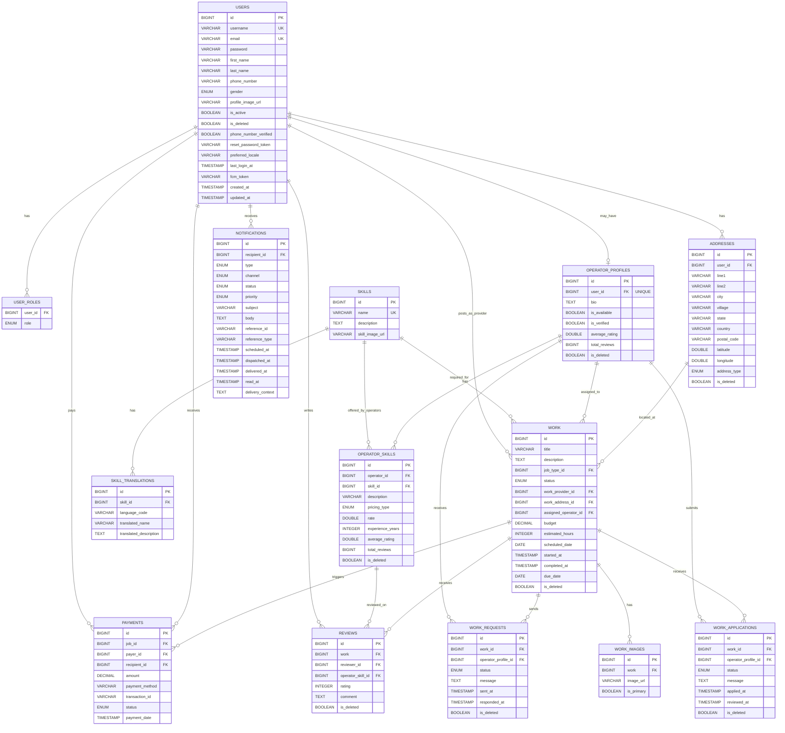

# The Mestri API - Visual ER Diagram (Mermaid)

View this file in GitHub or any Mermaid-compatible markdown viewer to see the visual diagram.

## Diagram Legend

- **PK**: Primary Key
- **FK**: Foreign Key
- **UK**: Unique Constraint
- **FK "UNIQUE"**: Foreign Key with Unique Constraint (One-to-One relationship)
- **||--o{**: One-to-Many relationship
- **||--o|**: One-to-One relationship

## Color Coding (when rendered)

The diagram shows relationships between entities. Key patterns:

1. **User-centric design**: Users at the center connecting to multiple modules
2. **Operator workflow**: Users → Operator Profiles → Operator Skills → Reviews
3. **Work lifecycle**: Users → Work → Applications/Requests → Assignments → Reviews → Payments
4. **Skill management**: Skills → Translations & Skills → Operator Skills
5. **Notification system**: All activities trigger notifications to users
